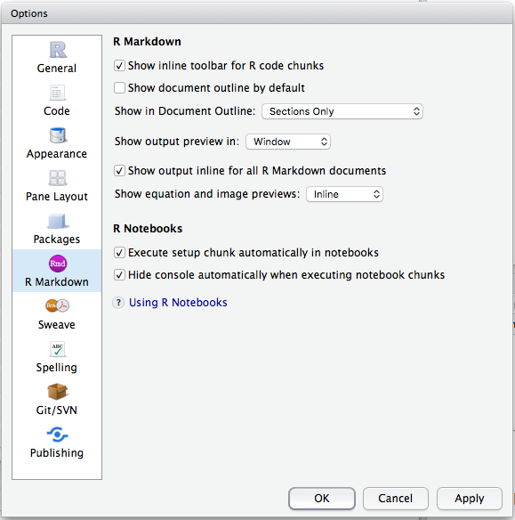

# Week Two Meeting {#week2}

For this week, everyone should have completed the reading listed in Section \@ref(week2reading). 
And everyone should have at least been trying to set up an RStudio Project with their own
data in it, and given a whack at reading their data into a variable.  


## Workflow and Project Recap

### Workflow: basics

#### Style

I just want to reiterate a few things that might seem minor, but are stylistically important
in the long run.

1. Don't use `=` for assignment.  Use `<-`.  On a Mac use Option-"-" to get that more quickly.
1. Put spaces around both sides of `=`, and `<-`, and other mathematical operators like `+`, `-`, `*`, etc.
1. Put spaces after commas. 
1. Use R-Studio's magical `Cmd-i` keyboard shortcut to automatically indent highlighted code.
1. If you want to really geek out, Hadley shares his style tips more completely 
in his [Advanced R Programming](http://adv-r.had.co.nz/Style.html) book.

This might seem pedantic, but adhering to these conventions makes it much easier for
people to read your code.

#### TAB-completion

This is HUGE!!  Start developing a twitchy left pinky now!

TAB early; TAB often!

Note that that completions of R code in the console or in the source window
are context dependent:

- variables in global environment
- Functions
- Quoted strings complete to filenames in directories
- Installed packages in `library()`
- Help topics after `?`
- Function arguments within a function's parentheses.  This is absolutely huge.  If you can't remember
all the different arguments a function takes, type the function and hit TAB within the parentheses.
Try typing `read.table()` and his TAB while the cursor is inside the parentheses. Use the up and 
down arrows to scroll through the options, hit TAB again to insert one. Note that after you have used
an argument it no longer appears in the list of options.


### Workflow: projects

#### Disable saving of workspace for sure!

Let's all walk through this.

#### Another worthwhile preference for small-screens (like laptops)

Make sure that the RMarkdown preference is set to open in: __Window__.
See Figure \@ref(fig:rmd-window).
```{r rmd-window, fig.cap='To read RMarkdown output in a separate page (highly recommended for laptops) choose "RMarkdown" on the left and choose "Window" from the dropdown menu, and click OK.', out.width="90%", fig.align='center', echo=FALSE}

```


#### Opening RStudio Projects from the OS (by clicking in the Finder)

- You can open an RStudio project by double clicking the RStudio Project icon
from, for example, a Mac Finder window.
It lives in a directory of the same name (but it has a `.Rproj` exension.)
- Or if you are a command line type,
use, for example `open my_project.Rproj` from the Terminal.
- You can open as many RStudio projects as you like at a time.
- Each RStudio project launches its own, completely separate R session!
- Interestingly, if you click on the `.Rproj` file of a project that is open,
RStudio will open another instance of that project.  So, don't click on the `.Rproj`
file for a project that is already open!
    + (In other applications on the Mac that will typically just take you to the currently
    open docuemnt, but not so with RStudio.)
- Use cmd-TAB to switch between open  RStudio projects.


#### Opening RStudio Projects from RStudio

- When you open existing projects using the "File->Open Project..."  menu option or with
the "File -> Recent Projects" menu option and you
currently have RStudio open "in another project,"" then the new project that you are opening
jumps in "on top of" the previous one.  It looks like your previous project has vanished
into the ether.  The OS thinks there is only one RStudio open, an it has the most
recently opened project in it.  WHERE'S MY OTHER ONE?!
- You can get back to it by clicking the project dropdown in the upper right of the project.
- However, if you switch between projects this way it restarts R each time you switch back
to your project so it takes a lot of time and it is super-annoying.
- If you are working concurrently in multiple projects, I recommend opening 
them from the Finder (or Terminal) and switching between them using __Cmd-TAB__.


#### What is the `.Rproj` file, really

It is just a text file that stores some information and
any project-specific preferences if there are any.  Here is what 
`rep-res-eeb-2017.Rproj` looks like if you open it with a text editor:

```yaml
`r paste(readLines("rep-res-eeb-2017.Rproj"), collapse = "\n")`
```


#### R in an RStudio project launches in the project directory

- This makes reproducibility much easier.  You can find and load files
using _relative_ paths.  
- Everything you might be accessing from R (data, scripts, etc.) or 
outputting from R will be easy to get to if they are "in the project"
- When we say that a file is "in the project" we mean that it is stored 
on disk somewhere within the project directory.
- The project directory (sometimes called the _root_ of the project directory)
is just the directory that contains the `.Rproj` file.
- Expert user tip:  `rprojroot::find_rstudio_root_file()` (part of the `rprojroot` package)
let's you find the root of an RStudio project directory.  This can be helpful sometimes....


### Workflow: scripts

- Script editor window vs console window
- Keyboard shortcuts for evaluating codes in your scripts:
    + __Cmd-Return__  (sends current line to console and advances cursor to next line)
    + __Highlight with Cmd-Return__ (send highlighted code to console)
        + For this, __Shift-up-arrow__ and __Shift-down-arrow__ are good for highlighting.
        + As is __Shift-Command-right-arrow__ or __Shift-command-left-arrow__.

## Let's talk about the pipe `%>%`

For anyone who had ever worked comfortably in Unix for a long time, and was
used to chaining the output of one utility in as the input for another utility
using the pipe: `|`, R's syntax for composition of functions was always super
cumbersome and required all sorts of nasty, nested parentheses.  

Consider this simple set of operations: imagine we want to

1. simulate 1000 gamma random variables, $G$, with parameters $\alpha=5$ and $\beta = 1$,
1. for each $G$ simulate a Poisson random variable with mean (`lambda`) $G$.
1. take the `sqrt` of each such variable
1. compute the variance of the result

This can all be done in one line, but is ugly!

```{r sim-pipe}
# set random seed for reproducibility
set.seed(5)

var(sqrt(rpois(n = 1000, lambda = rgamma(n = 1000, shape = 5, scale = 1))))
```

It doesn't matter how stylishly you include spaces in your code, this is just Fugly!

You can write it on multiple lines, but it is friggin' ghastly! Maybe worse than before.
```{r sim-pipe-multiline}
set.seed(5)

var(
  sqrt(
    rpois(n = 1000, lambda = rgamma(
      n = 1000, shape = 5, scale = 1
    )
    )
  )
)
```

The problem is that the order in which the operations are done does not match 
the way things are written: the first thing to get done is the call to `rgamma`,
which is nested deeply within the parentheses.

Enter the R "pipe" symbol.  It is not as convenient to type as `|`, but you can
make it quickly with the keyboard shortcut `cmd-shift-M`:  `%>%`.  This was introduced
in the `magrittr` package, and the `tidyverse` imports the `%>%` symbol from `magrittr`.  

Behold!
```{r true-pipe, message=FALSE}
library(tidyverse)
set.seed(5)

rgamma(n = 1000, shape = 5, scale = 1) %>%
  rpois(n = 1000, lambda = .) %>%          # pass G is as the lambda parameter using the dot: .
  sqrt() %>%                               # no dot here, so the previous result is just the first argument to sqrt
  var()                                    # same here
```
That is a hell of a lot easier to read!  It gives me goose bumps it is so elegant.

The `%>%` symbol says, "take the result that occurred before the `%>%` and pass it in as the `.` in whatever follows
the `%>%`."  Furthermore, if there is no `.` in the expression after the `%>%`, simply pass 
the result that occurred before the `%>%` in as the _first argument_ in the function call that comes after the `%>%`.

This type of "chaining" of operations is particularly powerful when operating on `tibbles` using `dplyr`


## Tibbles and "rectangular" data

gonna talk about data types too.

## Data import

